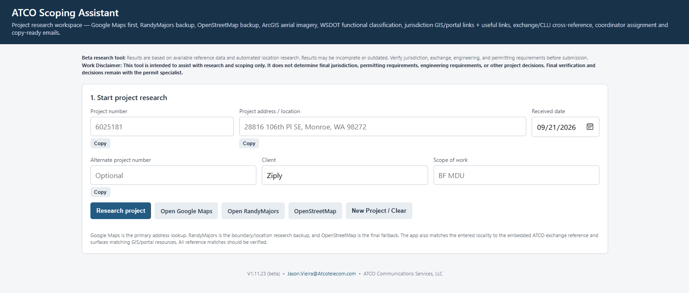
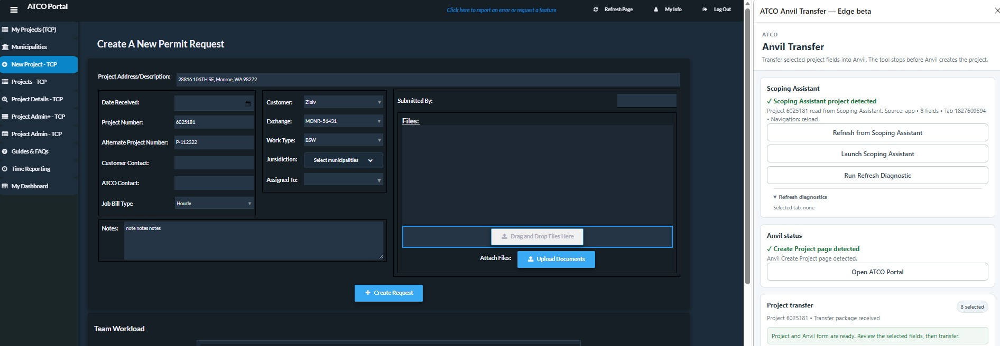

# ATCO Scoping Assistant

> A lightweight workspace for researching, organizing, and reviewing project scoping information.

<p align="center">
  
</p>

---

## 🚀 Get Started

### [Open the ATCO Scoping Assistant](https://telecom-infra.github.io/scoping-assistant-site/)

The Scoping Assistant is designed to make project research easier by bringing commonly used research resources and project information into one place.

It can be used **independently** as a browser-based scoping tool.

> **Quick link:** [telecom-infra.github.io/scoping-assistant-site](https://telecom-infra.github.io/scoping-assistant-site/)

---

## 🔎 What It Does

The Scoping Assistant helps with research such as:

**Location & Mapping**  
Google Maps, alternate map resources, coordinates, imagery, and location verification.

**Jurisdiction Research**  
County and municipal resources, GIS links, permitting resources, and jurisdiction references.

**Project References**  
Exchange, CLLI, engineering, coordinator, and other reference information.

**Project Preparation**  
Organize researched information, review detected values, make corrections, and prepare project handoff information.

The tool is designed around a simple principle:

> **Research first. Verify everything. Then use the information.**

---

## 🧭 Typical Workflow

```text
Enter Project
      ↓
Research
      ↓
Review Results
      ↓
Verify / Edit
      ↓
Prepare Project
      ↓
(Optional) Transfer to Anvil
```

All populated information remains editable so the user can correct or refine research results before continuing.

---

# 🧩 Optional Browser Extension

The Scoping Assistant also has a companion **browser extension** for users who work with ATCO Anvil.

The extension is **optional**. The Scoping Assistant remains fully useful without it.

### What the Extension Does

After the project has been researched and reviewed, the extension can transfer the **current values** from the Scoping Assistant into the corresponding fields on the ATCO Anvil project creation screen.

```text
Scoping Assistant
      ↓
Research + Review
      ↓
Verify / Edit
      ↓
Browser Extension
      ↓
Populate Anvil
      ↓
Review Anvil
      ↓
Complete Remaining Information
      ↓
Create Project
```

The extension **does not create or submit the Anvil project**.

The final review and project creation remain a user action.



---

## 🌐 Browser Support

**Microsoft Edge is currently the primary tested browser.**

A Chrome version may also be available for testing.

---

## 📥 Extension

The latest extension package is available from the Scoping Assistant site.

### [Open the Scoping Assistant](https://telecom-infra.github.io/scoping-assistant-site/)

The site provides the current extension package and installation information.

---

## 🖼️ Interface Preview


---

## ⚠️ Beta

This tool is currently being tested with a small group of users.

Features and workflows may change as testing continues.

---

## Important

The Scoping Assistant is a **research and preparation tool**.

Information returned by the application should be reviewed and verified by the user before being used for operational, engineering, permitting, or other project decisions.

---

<p align="center">
  <sub>ATCO Scoping Assistant • Beta</sub>
</p>
